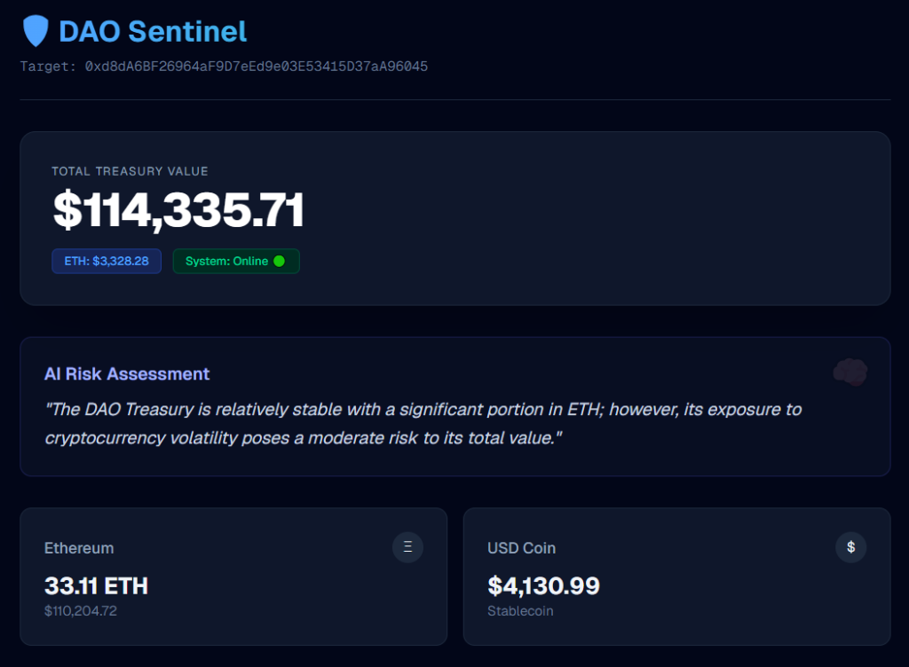

# 🛡️ DAO Sentinel Dashboard

**A Full-Stack Web3 Analytics Dashboard powered by Next.js and AI.**

This project is the frontend interface for the DAO Sentinel system. It fetches real-time blockchain data (ETH/ERC-20 balances) and displays AI-generated risk assessments in a modern UI.

## 📸 Preview

_(Disarankan: Upload screenshot dashboard-mu tadi ke sini)_

## 🚀 Tech Stack

- **Framework:** Next.js 14 (App Router)
- **Styling:** Tailwind CSS
- **Blockchain:** Ethers.js v6
- **AI Integration:** OpenAI API (via internal API Route)
- **Data Source:** CoinGecko & RPC Providers

## ⚡ Features

- **Real-time Valuation:** Calculates total treasury value in USD dynamically.
- **AI Analysis:** Server-side generation of risk reports based on portfolio allocation.
- **Responsive UI:** Modern dark-mode interface suitable for Web3 aesthetics.

## 📦 How to Run

1.  Clone repo & install: `npm install`
2.  Setup `.env.local` with `OPENROUTER_API_KEY`.
3.  Run dev server: `npm run dev`
